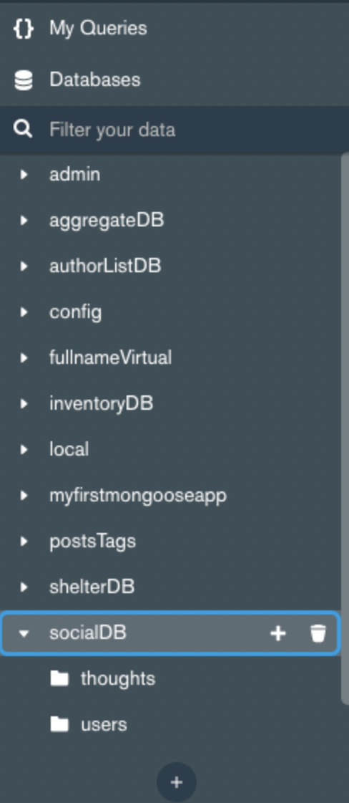

# SOCIAL NETWORK API

## Description
The Social Network API is a media platform where people can share thoughts to other people on the platform and they can interact with other peoples posts.

### Usage
The useage of this platform is to connect to like minded individuals within this website

### Installation
-Run (npm install) in the terminal.
-Run (npm start) in the terminal.

### Screenshots

### License
MIT License
